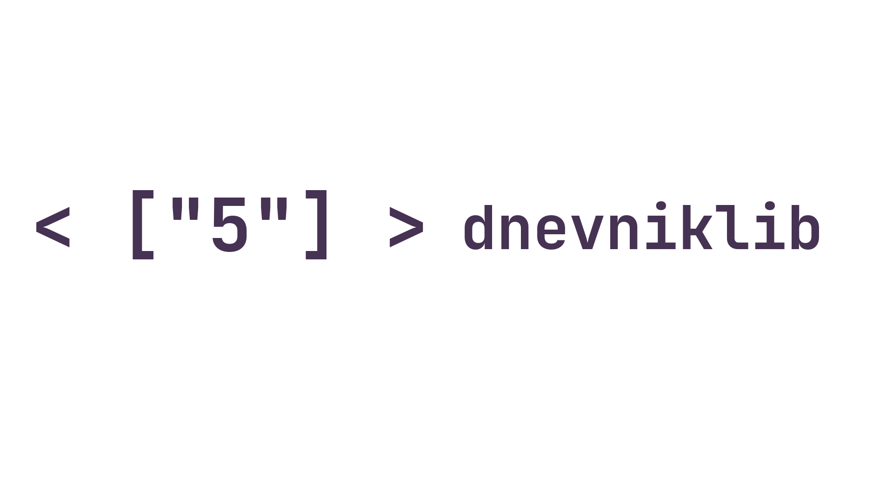

<h1 align="center">DnevnikLib</h1>
<p align="center">


</p>
<p align="center">
  <i>Open Source and exclusive library for automated work with Dnevnik</i>
</p>


### Table of contents:
* [About](#about) 
* [Docs](#docs)
  + [UserToken](#usertoken)
  + [User](#user)
  + [Marks](#marks)
  + [Homeworks](#homeworks)
  + [School](#school)
* [Thanks!](#thanks)

# About
<p align="center">
  <i><a href="https://pypi.org/project/dnevniklib/">PyPI library</a>. This library developed for one year, its a big time for this project. I am very happy for this project. This is a big push for a seventh grade developer. I've known since 5th grade that the diary app is very buggy, which interfered with the learning process. It was necessary to make a Telegram bot, but a foundation was needed. That's how the idea was born</i>
</p>


# Docs
<p align="center">
  <i>Its a Documentation for this library</i>
</p>

## UserToken

<p align="center">
  <i>New system to get auth token</i>
</p>

<h4>Create config file</h4>

```python
from dnevniklib.user_token_getter import UserToken
UserToken(_login="<LOGIN>", _password="<PASSW>", browser="<CHROME OR FIREFOX>", config_file="dnevnik.json").configuration() # File must be done, but error
```

<h4>Get token</h4>

```python
from dnevniklib.user_token_getter import UserToken
UserToken(_login="<LOGIN>", _password="<PASSW>", browser="<CHROME OR FIREFOX>", config_file="dnevnik.json").get_token() # Wait 10-15 second
```

## User


<h4>Get user attendance</h4>


```python
from dnevniklib import User
user = User(token="")
print(user.get_attendance_by_date(to_date="", from_date="")) # The date in a supported format can be found User().get_date_in_format(year, month, day)
```

<h4>Get user name</h4>


```python
from dnevniklib import User
user = User(token="")
print(user.first_name)
```

<h4>Get user class</h4>


```python
from dnevniklib import User
user = User(token="")
print(user.class_name)
```


## Marks
<h4>Get user marks by date</h4>


```python
from dnevniklib import User, Marks
user = User(token="")
marks=Marks(user=user)
print(marks.get_marks_by_date(date="")) # The date in a supported format can be found User().get_date_in_format(year, month, day)
```

<h4>Get user trimester marks</h4>


```python
from dnevniklib import User, Marks
user = User(token="")
marks=Marks(user=user)
print(marks.get_trimester_marks(trimester=0)) 
```


## Homeworks

<h4>Get a homework by date</h4>


```python
from dnevniklib import User, Homeworks
user = User(token="")
homeworks=Homeworks(user=user)
print(homeworks.get_homeworks_by_date(date="")) # The date in a supported format can be found User().get_date_in_format(year, month, day)
```

## School

<h4>Get a school data</h4>

```python 
from dnevniklib import User, School
user = User(token="")
school=School(session=user.session, token=user.token, data_about_user=user.data_about_user)
print(school.get_info_about_school())
```


# Thanks!


<p align="center">
  <i>I would like to say a big thank you to one person. Without him, I would not have written such a project. He helped before writing the code. <a href="https://github.com/FixedOctocat">Fixed</a>, thank you!</i>
</p>