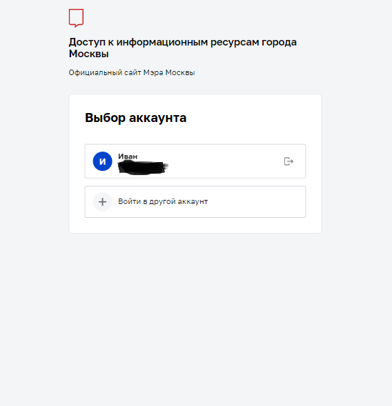
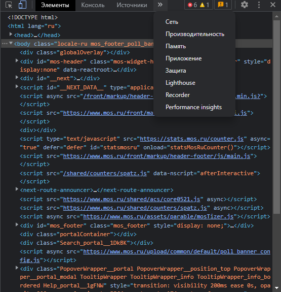
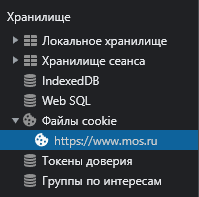
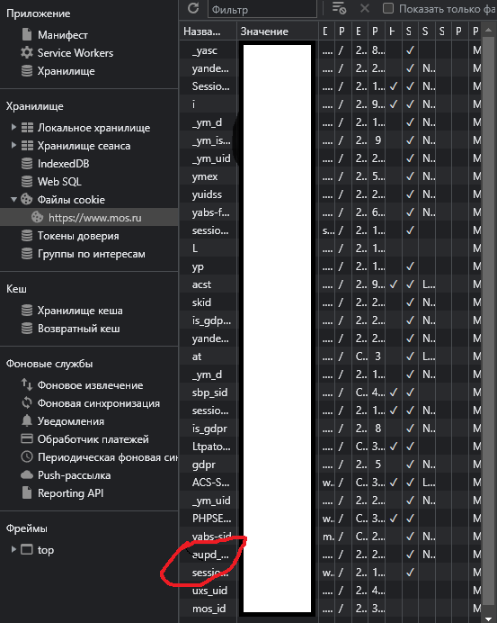

# Library for automated collection of information from the MES Diary ```dnevniklib 0.5```

At this stage, the entrance to the Diary through the library is available !!!ONLY!!! by authentication token, which will be fixed in future versions

### Code to get profile name
```python 
import dnevniklib
user = dnevniklib.User(token="<TOKEN>")
print(user.first_name)
```

### Code for getting grades
```python
import dnevniklib
user = dnevniklib.User(token="<TOKEN>")
marks = dnevniklib.Marks(user.session, user.token, user.id)
print(marks.get_marks_by_data("2022-11-16"))
```
# P.S: the date in all examples is entered in the format ```%Y-%m-%d```

### code for get homework
```python
import dnevniklib
user = dnevniklib.User(token="<TOKEN>")
homeworks = dnevniklib.Homeworks(user.session, user.token, user.id)
print(homeworks.get_homeworks_by_data("2022-11-16"))
```

### Code to get school data
```python
import dnevniklib
user = dnevniklib.User(token="<TOKEN>")
school_ = dnevniklib.School(user.session, user.token)
print(school_.get_info_about_school())
```

# How to get token?
<html>
 
</html>

### go to mos.ru

<html>
 
</html>

### login to mos.ru

<html>
 
</html>

### got to developer settings

<html>
 
</html>

### fing cookies file

<html>
 
</html>

### We find cookies with the aupd_token key - it is an authorization token

# Profit!!

# Changes in the new version:
 - ## New return data in marks and homeworks
 - ## User class getted insertions of func get data

## For bugs, contact the creator <a href="https://dirtyhornet277.t.me">TELEGRAM</a>